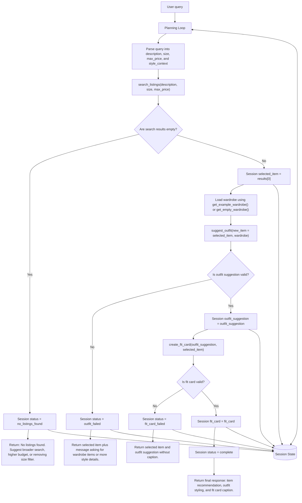

# FitFindr — planning.md

> Complete this document before writing any implementation code.
> Your spec and agent diagram are what you'll use to direct AI tools (Claude, Copilot, etc.) to generate your implementation — the more specific they are, the more useful the generated code will be.
> Your planning.md will be reviewed as part of your submission.
> Update it before starting any stretch features.

---

## Tools

List every tool your agent will use. For each tool, fill in all four fields.
You must have at least 3 tools. The three required tools are listed — add any additional tools below them.

### Tool 1: search_listings

**What it does:**
`search_listings` searches the resale listings data for clothing items that match the user's requested item description and optional filters. It should use `load_listings()` from `utils/data_loader.py` instead of manually reading `data/listings.json`.

**Input parameters:**

* `description` (str): The user's search phrase, such as `"vintage graphic tee"` or `"black denim jacket"`. This should be matched against listing fields like `title`, `description`, `category`, `style_tags`, `colors`, and `brand`.
* `size` (str | None): Optional clothing size filter, such as `"M"`, `"L"`, or `"8"`. If `None`, the search should not filter by size.
* `max_price` (float | None): Optional maximum price the user is willing to pay. If `None`, the search should not filter by price.

**What it returns:**
Returns a list of matching listing dictionaries sorted by relevance. Each result should include the original listing fields from `data/listings.json`:

* `id` (str): Unique listing ID.
* `title` (str): Listing name.
* `description` (str): Longer text describing the item.
* `category` (str): Clothing category, such as shirt, pants, shoes, jacket, or accessory.
* `style_tags` (list[str]): Style labels, such as vintage, streetwear, grunge, minimalist, or preppy.
* `size` (str): Listed item size.
* `condition` (str): Item condition, such as New, Like New, Good, or Fair.
* `price` (float): Listing price.
* `colors` (list[str]): Main colors of the item.
* `brand` (str): Brand name if available.
* `platform` (str): Marketplace source, such as Depop, eBay, Poshmark, or ThredUp.

The first result in the list should be the best match for the user's request.

**What happens if it fails or returns nothing:**
If no listings match, the agent should stop the workflow early. It should not call `suggest_outfit` or `create_fit_card`. The agent should tell the user that no matching listings were found and suggest specific changes, such as raising the max price, removing the size filter, or using a broader description like `"graphic tee"` instead of `"vintage band tee"`.

---

### Tool 2: suggest_outfit

**What it does:**
`suggest_outfit` creates a styling suggestion using the selected resale listing and the user's wardrobe. It should choose compatible wardrobe items based on category, colors, style tags, and the user's stated style context.

**Input parameters:**

* `new_item` (dict): The selected listing from `search_listings`. It should contain fields such as `id`, `title`, `category`, `style_tags`, `size`, `condition`, `price`, `colors`, `brand`, and `platform`.
* `wardrobe` (dict): The user's wardrobe data loaded from `get_example_wardrobe()` for normal testing or `get_empty_wardrobe()` for empty-wardrobe testing. The wardrobe should contain a list of wardrobe items. Each wardrobe item should include item details such as name/title, category, colors, style tags, and any notes available in `data/wardrobe_schema.json`.

**What it returns:**
Returns one outfit suggestion dictionary with:

* `outfit_summary` (str): A short styling recommendation written for the user.
* `new_item_title` (str): The title of the selected resale item.
* `used_wardrobe_items` (list[dict]): Wardrobe items used in the outfit. Each item should include enough detail to display it back to the user, such as name/title, category, colors, and style tags.
* `styling_notes` (list[str]): Specific styling instructions, such as how to tuck, layer, cuff, or accessorize the outfit.
* `aesthetic` (str): The overall style direction, such as `"90s grunge"`, `"streetwear"`, or `"minimal casual"`.

Example return value:

```python
{
    "outfit_summary": "Pair the faded band tee with your wide-leg jeans and chunky sneakers for a relaxed 90s grunge look.",
    "new_item_title": "Faded Band Tee",
    "used_wardrobe_items": [
        {"name": "wide-leg jeans", "category": "pants", "colors": ["blue"], "style_tags": ["baggy", "casual"]},
        {"name": "chunky sneakers", "category": "shoes", "colors": ["black", "white"], "style_tags": ["streetwear"]}
    ],
    "styling_notes": [
        "Roll the sleeves once.",
        "Tuck the front corner slightly for shape."
    ],
    "aesthetic": "90s grunge"
}
```

**What happens if it fails or returns nothing:**
If the wardrobe is empty, the agent should not pretend it used wardrobe items. It should return a clear fallback message saying it found a listing but cannot create a personalized outfit without wardrobe items. The agent should suggest adding wardrobe basics such as jeans, shoes, jackets, and accessories before trying again. If no valid outfit suggestion is returned, the agent should not call `create_fit_card`.

---

### Tool 3: create_fit_card

**What it does:**
`create_fit_card` turns the outfit suggestion and selected resale item into a short, social-media-style fit card caption. It should use the item title, price, platform, and styling recommendation to create a natural caption.

**Input parameters:**

* `outfit` (dict): The outfit suggestion returned by `suggest_outfit`. It should include `outfit_summary`, `used_wardrobe_items`, `styling_notes`, and `aesthetic`.
* `new_item` (dict): The selected listing returned by `search_listings`. It should include `title`, `price`, `platform`, `condition`, and any useful style fields.

**What it returns:**
Returns a dictionary with:

* `caption` (str): A short shareable caption for the outfit.
* `item_callout` (str): A short sentence naming the new item, platform, price, and condition.
* `style_summary` (str): A short explanation of why the outfit works.

Example return value:

```python
{
    "caption": "thrifted this faded band tee off depop for $22 and honestly it was made for my wide-legs 🖤 full look in my stories",
    "item_callout": "Faded Band Tee — $22 on Depop, Good condition.",
    "style_summary": "The faded tee, baggy jeans, and chunky sneakers create a relaxed 90s grunge outfit."
}
```

**What happens if it fails or returns nothing:**
If the outfit data is missing or incomplete, the agent should not generate a fake caption. It should return the selected listing and outfit summary if available, then tell the user that a fit card could not be created because the outfit data was incomplete.

---

### Additional Tools (if any)

No additional tools are planned for the required implementation. The agent only needs `search_listings`, `suggest_outfit`, and `create_fit_card`.

---

## Planning Loop

**How does your agent decide which tool to call next?**

The planning loop runs in a fixed order because this agent has a three-step workflow: search first, then style, then create a fit card.

1. Parse the user query into search inputs:

   * `description`: the main clothing item the user wants.
   * `size`: the requested size if the user gives one; otherwise `None`.
   * `max_price`: the requested budget if the user gives one; otherwise `None`.
   * `style_context`: any extra style information from the user, such as “I wear baggy jeans and chunky sneakers.”

2. Call:

   ```python
   results = search_listings(description=description, size=size, max_price=max_price)
   ```

3. After `search_listings` returns, check the results:

   * If `results` is empty:

     * Store an error message in session state.
     * Set `session["status"] = "no_listings_found"`.
     * Return early.
     * Do not call `suggest_outfit`.
     * Do not call `create_fit_card`.
   * If `results` is not empty:

     * Set `selected_item = results[0]`.
     * Store it in session state as `session["selected_item"]`.
     * Continue to outfit suggestion.

4. Load or receive the wardrobe:

   * Use `get_example_wardrobe()` when testing a normal user with wardrobe data.
   * Use `get_empty_wardrobe()` when testing the empty-wardrobe error path.

5. Call:

   ```python
   outfit_suggestion = suggest_outfit(new_item=selected_item, wardrobe=wardrobe)
   ```

6. After `suggest_outfit` returns, check the result:

   * If `outfit_suggestion` is missing, empty, or has no usable `outfit_summary`:

     * Store an error message in session state.
     * Set `session["status"] = "outfit_failed"`.
     * Return the selected listing plus a message asking the user to add wardrobe items or give more style details.
     * Do not call `create_fit_card`.
   * If `outfit_suggestion` is valid:

     * Store it in session state as `session["outfit_suggestion"]`.
     * Continue to fit card creation.

7. Call:

   ```python
   fit_card = create_fit_card(outfit=outfit_suggestion, new_item=selected_item)
   ```

8. After `create_fit_card` returns, check the result:

   * If `fit_card` is missing or has no `caption`:

     * Store an error message in session state.
     * Set `session["status"] = "fit_card_failed"`.
     * Return the selected listing and outfit suggestion without a caption.
   * If `fit_card` is valid:

     * Store it in session state as `session["fit_card"]`.
     * Set `session["status"] = "complete"`.
     * Return the final user-facing response.

The loop is done when one of these happens:

* No listings are found.
* No outfit can be suggested.
* No fit card can be created.
* All three tools succeed and the session contains `selected_item`, `outfit_suggestion`, and `fit_card`.

---

## State Management

**How does information from one tool get passed to the next?**

The agent should keep a session dictionary for one complete user request. Each tool reads from the current session state and writes its result back into the session.

Session fields:

```python
session = {
    "user_query": str,
    "description": str,
    "size": str | None,
    "max_price": float | None,
    "style_context": str | None,
    "search_results": list[dict],
    "selected_item": dict | None,
    "wardrobe": dict,
    "outfit_suggestion": dict | None,
    "fit_card": dict | None,
    "status": str,
    "error_message": str | None
}
```

Data flow:

1. The user query is parsed into `description`, `size`, `max_price`, and `style_context`.
2. `search_listings` receives `description`, `size`, and `max_price`.
3. The search result list is saved as `session["search_results"]`.
4. The first search result is saved as `session["selected_item"]`.
5. `suggest_outfit` receives `session["selected_item"]` and `session["wardrobe"]`.
6. The outfit suggestion is saved as `session["outfit_suggestion"]`.
7. `create_fit_card` receives `session["outfit_suggestion"]` and `session["selected_item"]`.
8. The final fit card is saved as `session["fit_card"]`.
9. The final response is built from `selected_item`, `outfit_suggestion`, and `fit_card`.

The agent should not rely on global variables for one user interaction. All information needed for the final response should be stored in the session dictionary.

---

## Error Handling

For each tool, describe the specific failure mode you're handling and what the agent does in response.

| Tool            | Failure mode                          | Agent response                                                                                                                                                                                                                                           |
| --------------- | ------------------------------------- | -------------------------------------------------------------------------------------------------------------------------------------------------------------------------------------------------------------------------------------------------------- |
| search_listings | No results match the query            | Stop the workflow. Tell the user: “I couldn’t find any listings matching that search. Try raising your budget, removing the size filter, or using a broader keyword like ‘graphic tee.’” Do not call `suggest_outfit` or `create_fit_card`.              |
| suggest_outfit  | Wardrobe is empty                     | Stop before fit card creation. Tell the user: “I found a listing, but I don’t have enough wardrobe items to build a personalized outfit. Add a few basics like jeans, shoes, jackets, or accessories, then try again.” Return the selected listing only. |
| create_fit_card | Outfit input is missing or incomplete | Return the listing and outfit summary if available, but do not invent a caption. Tell the user: “I found the item and styling idea, but I could not create a fit card because the outfit data was incomplete.”                                           |

---

## Architecture




---

## AI Tool Plan

**Milestone 3 — Individual tool implementations:**

I will use ChatGPT to implement each required tool separately. For each tool, I will give the AI tool the matching tool spec from the `## Tools` section and the relevant failure row from the `## Error Handling` section.

For `search_listings`, I will provide:

* The `Tool 1: search_listings` spec.
* The listing field descriptions.
* The requirement to use `load_listings()` from `utils/data_loader.py`.
* The no-results failure behavior.

Expected output:

* A `search_listings(description: str, size: str | None, max_price: float | None) -> list[dict]` function.
* It should filter by size when size is provided.
* It should filter by max price when max price is provided.
* It should match the description against title, description, category, style tags, colors, and brand.
* It should return matching listing dictionaries sorted by relevance.

Verification before using:

* Read the generated code and confirm it calls `load_listings()` instead of manually opening the JSON file.
* Check that optional `size` and `max_price` do not break when they are `None`.
* Run focused checks with:

  * A query expected to return results.
  * A query with `max_price`.
  * A query expected to return no results.

For `suggest_outfit`, I will provide:

* The `Tool 2: suggest_outfit` spec.
* The wardrobe schema from `data/wardrobe_schema.json`.
* The expected return dictionary structure.
* The empty-wardrobe failure behavior.

Expected output:

* A `suggest_outfit(new_item: dict, wardrobe: dict) -> dict | None` function.
* It should choose compatible wardrobe items by category, colors, and style tags.
* It should return `outfit_summary`, `new_item_title`, `used_wardrobe_items`, `styling_notes`, and `aesthetic`.

Verification before using:

* Check that the function does not crash when the wardrobe is empty.
* Check that it does not claim to use wardrobe items that are not in the wardrobe.
* Run one focused test with `get_example_wardrobe()` and one focused test with `get_empty_wardrobe()`.

For `create_fit_card`, I will provide:

* The `Tool 3: create_fit_card` spec.
* The expected outfit dictionary shape.
* The selected listing dictionary shape.
* The incomplete-input failure behavior.

Expected output:

* A `create_fit_card(outfit: dict, new_item: dict) -> dict | None` function.
* It should return `caption`, `item_callout`, and `style_summary`.
* It should use the selected item’s title, price, platform, and condition.
* It should not create a caption if required outfit fields are missing.

Verification before using:

* Check that the function validates required fields before building a caption.
* Run one focused test with a complete outfit.
* Run one focused test with missing outfit data.

**Milestone 4 — Planning loop and state management:**

I will use ChatGPT to implement the planning loop after the individual tools work. I will give it:

* The full `## Planning Loop` section.
* The full `## State Management` section.
* The Mermaid diagram from `## Architecture`.
* The full `## Error Handling` table.
* The completed interaction walkthrough from the bottom of this file.

Expected output:

* A planning loop function that runs the tools in the correct order.
* A session dictionary that stores the user query, parsed search inputs, search results, selected item, wardrobe, outfit suggestion, fit card, status, and error message.
* Early returns for:

  * No listings found.
  * Empty or invalid outfit suggestion.
  * Missing or invalid fit card.
* A final response built from the selected item, outfit suggestion, and fit card.

Verification before using:

* Trace the code against the architecture diagram and confirm every branch exists.
* Confirm `suggest_outfit` is never called when `search_listings` returns an empty list.
* Confirm `create_fit_card` is never called when `suggest_outfit` fails.
* Run focused checks for:

  * Complete successful flow.
  * No listings found.
  * Empty wardrobe.
  * Missing outfit data.

---

## A Complete Interaction (Step by Step)

Write out what a full user interaction looks like from start to finish — tool call by tool call. Use a specific example query.

**Example user query:** "I'm looking for a vintage graphic tee under $30. I mostly wear baggy jeans and chunky sneakers. What's out there and how would I style it?"

**Step 1:**
The agent parses the user query:

* `description = "vintage graphic tee"`
* `size = None`
* `max_price = 30.0`
* `style_context = "I mostly wear baggy jeans and chunky sneakers."`

Then it calls:

```python
search_listings(description="vintage graphic tee", size=None, max_price=30.0)
```

**Step 2:**
`search_listings` searches the listings data and returns matching listings sorted by relevance.

Example return value:

```python
[
    {
        "id": "listing_001",
        "title": "Faded Band Tee",
        "description": "Soft vintage-style graphic band tee with faded print.",
        "category": "shirt",
        "style_tags": ["vintage", "graphic", "grunge"],
        "size": "M",
        "condition": "Good",
        "price": 22.0,
        "colors": ["black", "gray"],
        "brand": "Unknown",
        "platform": "Depop"
    }
]
```

The planning loop checks that the list is not empty. Since a result exists, it sets:

```python
session["search_results"] = results
session["selected_item"] = results[0]
```

The selected item is `"Faded Band Tee"`.

**Step 3:**
The agent loads the user's wardrobe. For normal testing, it uses:

```python
wardrobe = get_example_wardrobe()
```

Then it calls:

```python
suggest_outfit(new_item=session["selected_item"], wardrobe=wardrobe)
```

Example return value:

```python
{
    "outfit_summary": "Pair the faded band tee with your wide-leg jeans and chunky sneakers for a relaxed 90s grunge look.",
    "new_item_title": "Faded Band Tee",
    "used_wardrobe_items": [
        {"name": "wide-leg jeans", "category": "pants", "colors": ["blue"], "style_tags": ["baggy", "casual"]},
        {"name": "chunky sneakers", "category": "shoes", "colors": ["black", "white"], "style_tags": ["streetwear"]}
    ],
    "styling_notes": [
        "Roll the sleeves once.",
        "Tuck the front corner slightly for shape."
    ],
    "aesthetic": "90s grunge"
}
```

The planning loop checks that the outfit suggestion is valid and has an `outfit_summary`. Since it is valid, it sets:

```python
session["outfit_suggestion"] = outfit_suggestion
```

**Step 4:**
The agent calls:

```python
create_fit_card(
    outfit=session["outfit_suggestion"],
    new_item=session["selected_item"]
)
```

Example return value:

```python
{
    "caption": "thrifted this faded band tee off depop for $22 and honestly it was made for my wide-legs 🖤 full look in my stories",
    "item_callout": "Faded Band Tee — $22 on Depop, Good condition.",
    "style_summary": "The faded tee, baggy jeans, and chunky sneakers create a relaxed 90s grunge outfit."
}
```

The planning loop checks that the fit card is valid and has a `caption`. Since it is valid, it sets:

```python
session["fit_card"] = fit_card
session["status"] = "complete"
```

**Final output to user:**
The user sees the selected item, the outfit suggestion, and the fit card caption.

Example final response:

```text
I found this: Faded Band Tee — $22 on Depop, Good condition.

How to style it:
Pair it with your wide-leg jeans and chunky sneakers for a relaxed 90s grunge look. Roll the sleeves once and tuck the front corner slightly for shape.

Fit card:
thrifted this faded band tee off depop for $22 and honestly it was made for my wide-legs 🖤 full look in my stories
```

**Error path:**
If `search_listings(description="vintage graphic tee", size=None, max_price=30.0)` returns an empty list, the planning loop sets:

```python
session["status"] = "no_listings_found"
session["error_message"] = "I couldn’t find any listings matching that search. Try raising your budget, removing the size filter, or using a broader keyword like 'graphic tee'."
```

Then the agent returns that message to the user and stops. It does not call `suggest_outfit` or `create_fit_card`.
